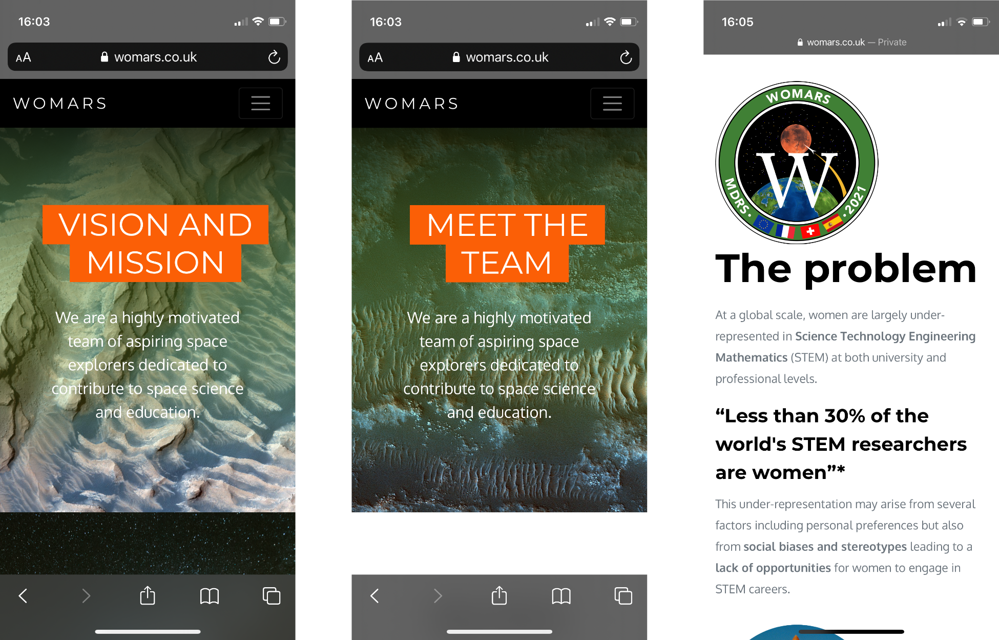

# WoMars website

WoMars is a non-profit organisation dedicated to promoting space sciences among younger generations and specifically among young girls and women.
I built the website for the organisation. With no web development background, I only used HTML/CSS and a bit of PHP for the contact form.
You can visit the website [here](https://womars.co.uk/)

**Languages:** HTML/CSS + PHP

## Home page

## Research page

     
## Contact form

## Mobile device snapshots

